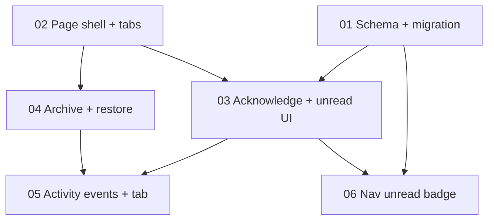

# PRD 001 — Submissions Organization (Unread, Acknowledge, Archive, Activity)

**Status:** Implemented (2026-08-03) — manual UI test pass pending (see [TEST-PLAN.md](TEST-PLAN.md))
**Depends on:** Nothing (first PRD in this repo)
**Blocks:** Nothing
**App:** `apps/internal/` (admin portal) + one migration in `packages/db/`

## Source material

- [source/transcript.md](source/transcript.md) — verbatim Google Meet transcript, [PTS] Weekly Planning, Aug 3 2026
- [source/gemini-summary.md](source/gemini-summary.md) — verbatim Gemini quick notes + full notes
- [ARCHITECTURE-REVIEW.md](ARCHITECTURE-REVIEW.md) — audit findings (C1, W1–W3, I1–I3, PW1–PW2, PI1–PI2) and their resolutions, incorporated inline in the sections

**Gemini accuracy notes** (verified against transcript):

1. Gemini's "team decided to adopt a new pricing structure… replaces previous hourly billing" is overstated — the transcript is exploratory ("I don't know what price point makes sense", "we can keep thinking about it"). Not portal work either way.
2. Gemini's "distinct, **publicly listed** Shopify app is created for each individual store" inverts the transcript: per-store apps avoid Shopify review precisely because they are *not* publicly listed (01:26:07–01:27:02).
3. "Monitoring services attribution strategy" is listed as an Aligned decision but was explicitly brainstorm ("food for thought", 00:59:27).
4. "Dashboard now supports image uploads, multi-context selection, and granular chat controls" describes the **Canvas Playground** (a separate app the portal only links out to via `CANVAS_PLAYGROUND_URL`), not this portal.
5. The "Git-based wiki" quick note frames a decision; the transcript floated either a dashboard documents section or a git-based flow with no commitment (00:35:58–00:39:58).

The portal-scoped asks (00:39:58–00:52:34) — unread indicator, acknowledge button, nav count badge, archive — are accurately captured by Gemini and are what this PRD covers.

## What this PRD covers

1. [01-schema-acknowledgement.md](01-schema-acknowledgement.md) — `acknowledged_at` / `acknowledged_by` columns on `form_submissions`, unread partial index, migration with backfill, intake-upsert interaction
2. [02-page-shell-tabs.md](02-page-shell-tabs.md) — rebuild `/submissions` on the hour-blocks page shell: List / Archive / Activity tabs, filters + count in the tabs row
3. [03-acknowledge-unread.md](03-acknowledge-unread.md) — unread row indicator, Acknowledge server action + buttons
4. [04-archive-restore.md](04-archive-restore.md) — archive/restore server actions, Archive tab with restore
5. [05-activity-events.md](05-activity-events.md) — `SUBMISSION` activity domain, logging on acknowledge/archive/restore, Activity tab feed
6. [06-nav-unread-badge.md](06-nav-unread-badge.md) — unread count badge on the Submissions sidebar item
7. [07-future-scope.md](07-future-scope.md) — everything discussed but deferred

## What's NOT in scope

- Email alerts for completed submissions (tentative in transcript — future scope)
- UTM attribution investigation (marketing-site/PostHog debugging, Kris tasked separately — future scope)
- Promote-to-lead from a submission (explicitly declined by Kris: "trying to keep as little manual work as possible")
- Permanent destroy of submissions (soft delete only; see future scope)
- PostHog server tracking for submissions actions (W2 — `SettingsEntity` union and `SETTINGS_SAVE` semantics don't fit; purpose-built events are future scope)
- Role-scoping the activity API (W1) — the systemic fix has since **landed in code** (`fetchActivityLogs` allowlist + row scoping; see [ARCHITECTURE-REVIEW.md](ARCHITECTURE-REVIEW.md)); this PRD only verifies that `SUBMISSION` stays out of `CLIENT_VISIBLE_ACTIVITY_TARGET_TYPES`
- Anything on the marketing site (audit free-form question, email-capture A/B test)
- Canvas Playground features, pricing model, Shopify connectors, "powered by" email attribution

## Sections

| # | File | Complexity | Depends on |
|---|------|-----------|------------|
| 01 | [01-schema-acknowledgement.md](01-schema-acknowledgement.md) | Low | — |
| 02 | [02-page-shell-tabs.md](02-page-shell-tabs.md) | Medium | — |
| 03 | [03-acknowledge-unread.md](03-acknowledge-unread.md) | Medium | 01, 02 |
| 04 | [04-archive-restore.md](04-archive-restore.md) | Medium | 02 |
| 05 | [05-activity-events.md](05-activity-events.md) | Medium | 02, 03, 04 |
| 06 | [06-nav-unread-badge.md](06-nav-unread-badge.md) | Medium | 01, 03 |
| 07 | [07-future-scope.md](07-future-scope.md) | — | — |

## Key decisions

| # | Decision | Rationale (transcript) |
|---|----------|------------------------|
| D1 | **Unread = unacknowledged rows that warrant attention**: contact submissions (any status) and audit submissions with status `completed` or `captured`. `in_progress`/`abandoned` audits never count as unread. | Kris: "I don't really want to read all of them." Jason: "as we really drive ads, it's going to get noisy." Badge stays meaningful as ad volume grows. |
| D2 | **Explicit Acknowledge button only** — opening the detail sheet does not mark a submission read. | Jason: "an unread with an acknowledge button." Peeking shouldn't clear the flag. |
| D3 | **Archive = soft delete via existing `deleted_at`**, with an Archive tab and Restore — mirrors the hour-blocks pattern. No new status enum value. | Jason: "at the very least I want like an archive… so that we can just delete them really quick." Kris: "archive for sure I agree with." Owner directed reuse of the hour-blocks tab pattern during PRD planning. |
| D4 | **Page shell matches hour blocks**: route-based tabs (List `/submissions`, Archive `/submissions/archive`, Activity `/submissions/activity`), tabs row above the card with filters + total count on the right, `bg-background rounded-xl border p-6 shadow-sm` card. | Owner direction during PRD planning: "reuse the page shell from hour blocks so that the filters and count are all in the same place and the card behind the list looks the same." |
| D5 | **All three tabs including Activity**, backed by a new `SUBMISSION` activity target type and events for acknowledge/archive/restore. | Owner direction during PRD planning (full parity with hour blocks). `activity_logs.target_type` is a text column, so no migration is needed. |
| D6 | **Nav badge is server-fetched** in `(dashboard)/layout.tsx` and passed down; actions call `revalidatePath('/', 'layout')` to refresh it. No polling. | Owner selection during PRD planning. Simplest data path; count can lag until next render if a submission arrives while idle. |
| D7 | **Migration backfills existing rows as acknowledged** so the badge starts at 0 instead of counting historical abandoned audits. | Owner accepted default during PRD planning. |
| D8 | **A status advance re-flags an acknowledged row**: the intake upsert clears `acknowledged_at`/`acknowledged_by` when `status` advances (e.g. acknowledged `completed` audit later becomes `captured` when a late beacon delivers contact info). | Derived from the beacon upsert semantics in [form-submissions.ts](../../../apps/internal/lib/queries/form-submissions.ts) — the anonymous→identified transition is the highest-value signal and must not be swallowed by a prior acknowledgement. |
| D9 | **Detail-sheet behavior after in-sheet actions**: Acknowledge keeps the sheet open (optimistic update — you keep reading). Archive and Restore close the sheet, since the row leaves the current tab's list. | Owner selection during consistency check. |
| D10 | **Submissions nav item becomes admin-only** (`roles: ['ADMIN']` in `navigation-config.ts`, section 06). Fixes the pre-existing dead link where CLIENT users saw Submissions but hit the unauthorized page. | Owner selection during consistency check; matches the admin-only badge and page gate. |

## What already exists

| Surface | Current state | PRD changes |
|---------|---------------|-------------|
| `packages/db/src/schema.ts` → `formSubmissions` (line ~1637) | `kind`/`status` enums, `deleted_at` soft delete, attribution + analytics columns, 3 partial indexes | Adds `acknowledged_at`, `acknowledged_by`, unread partial index (01) |
| `apps/internal/lib/queries/form-submissions.ts` | `upsertFormSubmission` (beacon-safe), `listFormSubmissions`, `countFormSubmissions`, `getFormSubmissionById` — all filter `deleted_at IS NULL` | Upsert clears ack on status advance (01); archived-mode list/count (04); `acknowledgeFormSubmission`, `setFormSubmissionArchived` (03/04); `countUnreadFormSubmissions` (06) |
| `apps/internal/lib/data/form-submissions/index.ts` | `fetchFormSubmissions`, `fetchFormSubmissionById` — `assertAdmin`, React `cache()` | Archived mode param (04); `fetchUnreadSubmissionCount` (06) |
| `apps/internal/lib/form-submissions/constants.ts`, `types.ts` | Kind/status labels + badge tokens, type guards, `FormSubmissionRecord` | `isUnreadSubmission()` helper (03) |
| `apps/internal/app/(dashboard)/submissions/` | `page.tsx` + `_components/submissions-table.tsx` + `submission-detail-sheet.tsx` — read-only, filters inside the card, no `_actions/` | Restructured shell + tabs (02), actions dir (03/04), archive + activity routes (04/05) |
| `apps/internal/app/(dashboard)/hour-blocks/` | Reference implementation: `_components/hour-blocks-tabs-nav.tsx`, `archive/page.tsx`, `activity/page.tsx`, `actions/` with archive/restore, `_components/hour-block-archive-dialog.tsx` | Copied as the pattern — not modified |
| `apps/internal/lib/activity/types.ts`, `events/`, `logger.ts` | `ActivityTargetType` union (no `SUBMISSION`), `ActivityVerbs`, per-domain event builders, generic `ActivityFeed` component | `SUBMISSION` target type + 3 verbs + `events/submissions.ts` (05) |
| `apps/internal/components/layout/` | `navigation-config.ts` (NavItem has no badge concept), `sidebar.tsx` + `app-shell.tsx` (client components), `(dashboard)/layout.tsx` (server, fetches user) | Badge plumbing layout → AppShell → Sidebar (06) |

## Schema changes summary

One migration (section 01), generated from `packages/db/` via:

```bash
npm run db:generate -- --name form_submission_acknowledgement
```

- `form_submissions.acknowledged_at` — `timestamptz NULL`
- `form_submissions.acknowledged_by` — `uuid NULL REFERENCES users(id) ON DELETE SET NULL` (explicit ON DELETE per project convention; optional reference)
- Partial index `idx_form_submissions_unread` on `(kind, status)` `WHERE deleted_at IS NULL AND acknowledged_at IS NULL`
- Hand-added backfill statement marking all existing rows acknowledged (D7)

No `DbClient`-style snake-case twin exists for form submissions in `apps/internal/lib/types.ts` — the Drizzle-inferred `FormSubmission` type from `@pts/db/types` picks up the new columns automatically. **No RLS anywhere** (project rule).

## New / modified / removed infrastructure

| Type | Path | Section |
|------|------|---------|
| New | `apps/internal/app/(dashboard)/submissions/_components/submissions-tabs-nav.tsx` | 02 |
| New | `apps/internal/app/(dashboard)/submissions/_components/submissions-filters.tsx` | 02 |
| New | `apps/internal/app/(dashboard)/submissions/archive/page.tsx` | 04 |
| New | `apps/internal/app/(dashboard)/submissions/activity/page.tsx` | 05 |
| New | `apps/internal/app/(dashboard)/submissions/_components/submissions-activity-section.tsx` | 05 |
| New | `apps/internal/app/(dashboard)/submissions/_components/submission-archive-dialog.tsx` | 04 |
| New | `apps/internal/app/(dashboard)/submissions/actions/` (`acknowledge-submission.ts`, `archive-submission.ts`, `restore-submission.ts`, `helpers.ts`, `schemas.ts`, `types.ts`, `index.ts`) | 03/04 |
| New | `apps/internal/lib/activity/events/submissions.ts` | 05 |
| Modified | `packages/db/src/schema.ts`, `packages/db/src/relations.ts`, new migration in `packages/db/drizzle/migrations/` | 01 |
| Modified | `apps/internal/app/api/activity/route.ts` (C1 whitelist entry only — W1 gating already systemic) | 05 |
| Modified | `apps/internal/lib/queries/form-submissions.ts` | 01/03/04/06 |
| Modified | `apps/internal/lib/data/form-submissions/index.ts` | 04/06 |
| Modified | `apps/internal/lib/form-submissions/constants.ts` | 03 |
| Modified | `apps/internal/app/(dashboard)/submissions/page.tsx`, `_components/submissions-table.tsx`, `_components/submission-detail-sheet.tsx` | 02/03/04 |
| Modified | `apps/internal/lib/activity/types.ts`, `lib/activity/events.ts` | 05 |
| Modified | `apps/internal/components/layout/navigation-config.ts`, `sidebar.tsx`, `app-shell.tsx`, `app/(dashboard)/layout.tsx` | 06 |
| Removed | — (nothing removed; filters relocate from inside `submissions-table.tsx` to the tabs row) | 02 |

## Implementation order



**Recommended sequence:**

1. **01** (schema) and **02** (page shell) — independent, can be done in parallel or either order
2. **03** (acknowledge) — needs 01's columns and 02's shell
3. **04** (archive/restore) — needs 02's shell; independent of 03, can parallel it
4. **05** (activity) — instruments the actions from 03/04 and adds the Activity tab
5. **06** (nav badge) — needs 01's index and 03's unread predicate helper

After each section: run `npm run build`, `npm run lint`, `npm run type-check` from the repo root, then update [PROGRESS.md](PROGRESS.md) and walk the relevant [TEST-PLAN.md](TEST-PLAN.md) items.
