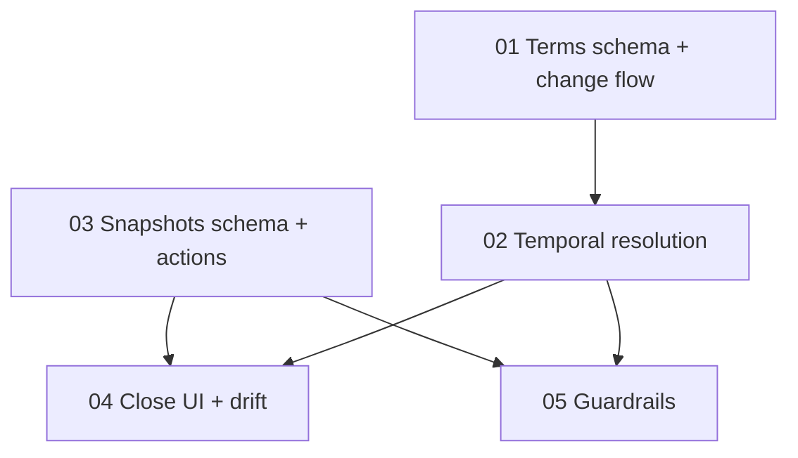

# PRD 002 — Billing Terms History & Monthly Close Locking

**Status:** Draft (2026-08-06) — not yet implemented
**Depends on:** Nothing
**Blocks:** Future commission-assignment history work (see [06-future-scope.md](06-future-scope.md))
**App:** `apps/internal/` (admin portal) + two migrations in `packages/db/`

## Problem

The first net_30 client is switching to prepaid hour blocks, and the Monthly Close Report ([apps/internal/lib/queries/reports/monthly-close.ts](../../../apps/internal/lib/queries/reports/monthly-close.ts)) derives everything from **current state applied to historical events**. All eight billing-type filter sites read the live `clients.billing_type` column: prepaid clients are counted from `hour_blocks.created_at`, net_30 clients from `time_logs.logged_on`. Flipping the column rewrites every past month — historical time-log billing rows vanish with no historical hour blocks to replace them.

This is one instance of a class (any mutable field the close depends on rewrites history), and separately, **late facts** (a time log entered Sept 1 backdated to Aug 30) can change a month already invoiced against. Two mechanisms cover both:

1. **Effective-dated inputs** — `client_billing_terms`; the close resolves billing type *as of the report month*, exactly how [apps/internal/lib/billing/partner-rates.ts](../../../apps/internal/lib/billing/partner-rates.ts) already resolves rates by period start. History stays re-derivable.
2. **Close snapshots** — an explicit "Close month" action freezes the assembled report; closed months render from the snapshot, with a live re-derivation surfacing **drift** (late/edited records) and a reopen → re-close path.

## Sections

| # | File | Complexity | Depends on |
|---|------|-----------|------------|
| 01 | [01-schema-client-billing-terms.md](01-schema-client-billing-terms.md) — terms table, backfill, billing change flow | Medium | — |
| 02 | [02-monthly-close-temporal-resolution.md](02-monthly-close-temporal-resolution.md) — as-of-period resolution in close queries | Medium | 01 |
| 03 | [03-schema-close-snapshots.md](03-schema-close-snapshots.md) — snapshots table, close/reopen actions, activity | Medium | — |
| 04 | [04-close-workflow-ui.md](04-close-workflow-ui.md) — close controls, snapshot rendering, drift banner | High | 02, 03 |
| 05 | [05-late-entry-guardrails.md](05-late-entry-guardrails.md) — write-time warnings | Medium | 02, 03 |
| 06 | [06-future-scope.md](06-future-scope.md) | — | — |

## What's NOT in scope

- Duplicating the client as a workaround (rejected — everything hangs off `client_id`; see D1)
- Future-dated scheduling of billing changes (pending state + sync cron) — changes apply at save (D10); the prepaid migration is one-way
- Roll-forward adjustments for already-paid closed months — reopen → re-close covers v1
- Effective-dating origination/closer assignments — same disease, separate PRD (06-future-scope)
- Enforcing the 5-hour minimum block size — sales policy, not a data rule
- Invoice generation changes; the partner rate schedule; client-portal (`apps/client/`) surfaces; mid-month cutovers (D3)

## Key decisions

| # | Decision | Rationale |
|---|----------|-----------|
| D1 | **One client row, forever.** Billing changes are history rows, never new clients. | Duplicates fragment every `client_id`-keyed feature. |
| D2 | **`client_billing_terms` is the source of truth for "billing type as of month M"; `clients.billing_type` stays as the current cache** (UI, invoice defaults, lead conversion). The close never reads the cache. | Minimal blast radius — only report queries change semantics. |
| D3 | **Month-start cutovers only**: `effective_from` CHECK-constrained to the 1st; resolution by period start. | Each month is single-basis per client — no mid-month time-log/hour-block double-count. |
| D4 | **Resolution rule**: greatest `effective_from` ≤ month start wins; no row → client excluded that month. | Same rule as `getPartnerRatesForPeriod`. |
| D5 | **Backfill one row per client** (`effective_from = '2000-01-01'`, current type), including soft-deleted clients. | Every historical month resolves exactly as it renders today — zero drift at migration. |
| D6 | **Close is an explicit action, not a calendar event.** Current month closable with a warning. | The common late-log case (a day or two after month end, before invoicing) costs nothing while the month is open. |
| D7 | **Reopen is always allowed; it soft-deletes the snapshot**; re-close inserts fresh. Unique partial index on `(year, month) WHERE deleted_at IS NULL`. | Full audit trail of every close. |
| D8 | **Closed months render from the snapshot**; a live re-derivation runs alongside and differences surface as a drift banner (per-section deltas + late/edited records). No dismiss — the banner persists until resolved. | Impossible to *unknowingly* pay out against stale numbers; `logged_on` vs `created_at` makes late entries detectable. |
| D9 | **Time-log/hour-block writes touching a closed month warn, not block; billing-term changes into closed months are hard-blocked.** | Late logging is legitimate; rewriting a closed month's billing basis never is. |
| D10 | **Billing changes apply at save — no pending state, no cron.** Cache flips in the save transaction; the terms row's boundary (this/next month radio) controls only report basis per month. | One-way prepaid migration; scheduling infrastructure isn't warranted. Cache and report intentionally disagree for the rest of the cutover month. |
| D11 | **New activity target `MONTHLY_CLOSE`** (text column, no migration); stays out of `CLIENT_VISIBLE_ACTIVITY_TARGET_TYPES`. Billing-term changes log under `CLIENT`. | Admin-only, same guard rationale as PRD 001 D10. |
| D12 | **Snapshot = fully assembled `MonthlyCloseReport` as JSONB** with `schemaVersion`, plus `closed_at`/`closed_by`. Renders without live queries; decode is zod-validated with an explicit unreadable-snapshot state. | The snapshot must survive future schema/logic changes — that's its purpose. |
| D13 | **Prepaid blocks are attributed by `hour_blocks.billing_month`** (default = creation month, clamped forward to the client's first prepaid month), not by creation month. | A block created before the boundary — manually or by the **Stripe webhook** on invoice payment, which no UI warning can reach — would otherwise never count in any month's Billing In. Attribution beats warnings. |

## What already exists

| Surface | Current state | PRD changes |
|---------|---------------|-------------|
| `packages/db/src/schema.ts` | `clientBillingType` enum (~37), `clients.billingType` (~157), `invoices.billingType` snapshot column (~1518) | Adds `client_billing_terms` (01), `monthly_close_snapshots` (03); `clients` untouched |
| [apps/internal/lib/queries/reports/monthly-close.ts](../../../apps/internal/lib/queries/reports/monthly-close.ts) | 8 filter sites on `eq(clients.billingType, …)`: `fetchOriginationCommissions` (4), `fetchCloserCommissions` (2), `fetchPrepaidBilling`, `fetchNet30Billing` | All 8 → as-of-period resolution (02) |
| [apps/internal/lib/data/reports/monthly-close.ts](../../../apps/internal/lib/data/reports/monthly-close.ts) | `fetchMonthlyCloseReport(startDate, endDate)`, React `cache()` | Snapshot-aware wrapper + drift computation (04) |
| [apps/internal/lib/billing/partner-rates.ts](../../../apps/internal/lib/billing/partner-rates.ts) | Code-defined effective-dated rates, resolved by period start | Unchanged — the pattern 01/02 mirror |
| [apps/internal/lib/settings/clients/](../../../apps/internal/lib/settings/clients/) | `client-service.ts` zod schema, `actions/create-client.ts`, `actions/update-client.ts` (billingType diff → activity), sheet form state | Create inserts initial term; update gains boundary radio + term upsert (01) |
| [apps/internal/lib/leads/actions/convert-lead.ts](../../../apps/internal/lib/leads/actions/convert-lead.ts) | Creates client with `billingType` | Inserts initial term (01) |
| [apps/internal/app/(dashboard)/reports/monthly-close/](<../../../apps/internal/app/(dashboard)/reports/monthly-close/>) | `page.tsx` month params → date range → fetch; `report-header.tsx`, summary cards, section sheets, `formula-notice.tsx` | Close controls, snapshot rendering, drift banner (04) |
| Time-log API routes (`apps/internal/app/api/projects/[projectId]/time-logs/`) over [apps/internal/lib/queries/time-logs/mutations.ts](../../../apps/internal/lib/queries/time-logs/mutations.ts) | No month-close awareness | Admin-only closed-month `warning` in the route JSON responses (05) |
| [apps/internal/app/(dashboard)/hour-blocks/actions/](<../../../apps/internal/app/(dashboard)/hour-blocks/actions/>) | Hour block create/edit/archive | Sets `billing_month` on create (01); closed-month warnings (05) |
| Stripe webhook → [apps/internal/lib/data/invoices.ts](../../../apps/internal/lib/data/invoices.ts) `createHourBlocksFromInvoice` | Auto-creates hour blocks when a prepaid invoice is paid | Sets `billing_month` via the shared resolver (01, D13) |
| [apps/internal/lib/queries/time-logs/mutations.ts](../../../apps/internal/lib/queries/time-logs/mutations.ts) | `updateTimeLog`/`softDeleteTimeLog` do **not** set `updatedAt` | Both add `updatedAt` to `.set()` — required for drift attribution (04, F1) |
| [apps/internal/lib/activity/](../../../apps/internal/lib/activity/) | `types.ts` target union, `events/clients.ts`, `logger.ts` | `MONTHLY_CLOSE` target + events (03); `effectiveFrom` in billing-type diff (01) |
| `apps/internal/lib/types.ts` | `DbClient` snake-case twin of `clients` | Unchanged — `clients` untouched; new tables use Drizzle-inferred types |

## Schema changes summary

Two migrations from `packages/db/`:

```bash
npm run db:generate -- --name client_billing_terms
npm run db:generate -- --name monthly_close_snapshots
```

**`client_billing_terms`** (01): `id` PK · `client_id` → clients RESTRICT · `billing_type` enum · `effective_from` date · `created_by` → users SET NULL · timestamps + `deleted_at`. Hand-added: sentinel preflight assert, month-start CHECK, unique partial `(client_id, effective_from)`, resolution index `(client_id, effective_from DESC)`, backfill INSERT. **Same migration** also adds `hour_blocks.billing_month` (date NOT NULL, month-start CHECK, partial index; backfill = creation month) per D13.

**`monthly_close_snapshots`** (03): `id` PK · `year`/`month` ints (CHECK 1–12) · `report` jsonb · `closed_at` · `closed_by` → users SET NULL · timestamps + `deleted_at`. Hand-added: unique partial `(year, month)`.

**No RLS anywhere** (project rule).

## New / modified infrastructure

| Type | Path | Section |
|------|------|---------|
| New | `packages/db/src/schema.ts` → `clientBillingTerms`, `monthlyCloseSnapshots` + relations; `billingMonth` column on `hourBlocks` | 01/03 |
| New | `apps/internal/lib/queries/clients/billing-terms.ts` | 01/02 |
| New | `apps/internal/lib/queries/reports/close-snapshots.ts` | 03/04 |
| New | `apps/internal/lib/data/reports/close.ts` | 03 |
| New | `apps/internal/app/(dashboard)/reports/monthly-close/actions/` (`close-month.ts`, `reopen-month.ts`, `reclose-month.ts`, `schemas.ts`, `types.ts`) | 03 |
| New | `apps/internal/app/(dashboard)/reports/monthly-close/_components/close-controls.tsx`, `drift-banner.tsx`, `closed-notice.tsx` | 04 |
| New | `apps/internal/lib/activity/events/monthly-close.ts` | 03 |
| Modified | `apps/internal/lib/queries/reports/monthly-close.ts` (8 filter sites) | 02 |
| Modified | `apps/internal/lib/data/reports/monthly-close.ts`, `types.ts` | 02/04 |
| Modified | `apps/internal/lib/settings/clients/client-service.ts`, `actions/create-client.ts`, `actions/update-client.ts`, client sheet components | 01 |
| Modified | `apps/internal/lib/data/invoices.ts` (`createHourBlocksFromInvoice` sets `billing_month`), hour-block `save-hour-block.ts` (same) | 01 |
| Modified | `apps/internal/lib/queries/time-logs/mutations.ts` (`updatedAt` bumps in update/soft-delete) | 04 |
| Modified | `apps/internal/lib/activity/types.ts`, `events.ts`, `events/clients.ts` | 01/03 |
| Modified | `apps/internal/app/(dashboard)/reports/monthly-close/page.tsx`, `_components/report-header.tsx` | 04 |
| Modified | time-log API routes (`app/api/projects/[projectId]/time-logs/`) + hour-block actions (warning plumbing) | 05 |

## Implementation order



1. **01** (terms schema + change flow) — 01's closed-month guard ships behind a stub until 03 lands
2. **02** (temporal resolution) — after this, the first client's flip is safe end to end
3. **03** (snapshots + actions) — independent of 01/02, can parallel them
4. **04** (close UI + drift) — needs 02 + 03
5. **05** (guardrails) — purely additive warnings

After each section: `npm run build`, `npm run lint`, `npm run type-check` from the repo root, then update [PROGRESS.md](PROGRESS.md) and walk the relevant [TEST-PLAN.md](TEST-PLAN.md) items.
