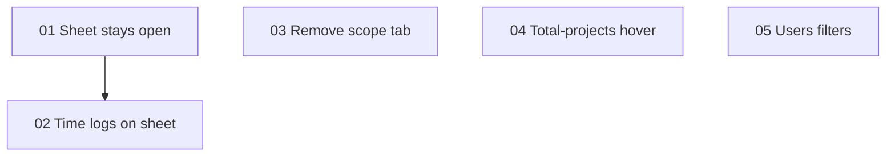

# PRD 003 — In-Person Feedback: Task Sheet Time Logging, Scope Removal, List Polish

**Status:** Draft (2026-08-07) — not yet implemented
**Depends on:** Nothing
**Blocks:** Nothing
**App:** `apps/internal/` (admin portal) + one drop migration in `packages/db/`

## Source material

[source/discussion-notes.md](source/discussion-notes.md) — verbatim bullet notes from an in-person discussion between Jason and Kris on 2026-08-07, plus a same-day addendum (surface time logs on tasks). **No transcript or Gemini summary exists for this session** — the notes are first-party and were archived before analysis; there are no accuracy discrepancies to flag. A repeat-ask sweep across PRD 001 and 002 sources found **zero repeats**; all five asks are first-time requests.

## What this PRD covers

1. **Task sheet stays open on save** (01) — saving no longer auto-closes the sheet on My Tasks and the project board; a create transitions the sheet into edit mode so Planning is immediately available.
2. **Time logging on the task sheet** (02) — a "Log time" button (existing dialog, task pre-linked) plus an editable list of time logs already linked to the task, with total hours.
3. **Remove the Scope tab and SOW functionality entirely** (03) — routes, components, queries, actions, the Google Docs/Drive/Picker integration layer, and a migration dropping the three SOW tables and both enums.
4. **Clients: total-projects hover** (04) — the "(N total)" text becomes a hover card listing all projects with status badges, mirroring the active-projects hover.
5. **Users: role + access filters** (05) — dropdown filters (All/Admin/Client and Enabled/Disabled) using the submissions filter pattern.

## What's NOT in scope

- The lead task overlay keeping the sheet open after save — it's a quick-capture flow layered over the lead sheet and keeps close-on-save (D1)
- An inline time-entry mini-form in the task sheet — the existing dialog is reused instead (D4)
- Exporting SOW snapshot data before the drop — rejected; source documents remain in Google Docs (D6)
- Narrowing the shared `GOOGLE_SCOPES` OAuth consent list — live-behavior change, deferred ([06-future-scope.md](06-future-scope.md))
- The clients **archive** page's management table (bare active-projects number, no total column) — unchanged
- Hours-logged aggregates on task cards / kanban board — sheet-only for now (06)
- Any `apps/client/` surface — every feature here is internal-portal-only
- Changing the "(N total)" display rule (only shown when total > active) — kept as-is (D9)

## Sections

| # | File | Complexity | Depends on |
|---|------|-----------|------------|
| 01 | [01-task-sheet-stay-open.md](01-task-sheet-stay-open.md) — remove auto-close, create→edit transition, save returns id | High | — |
| 02 | [02-task-sheet-time-logs.md](02-task-sheet-time-logs.md) — Log time button + linked-logs list, new by-task query | Medium-High | 01 |
| 03 | [03-remove-scope-tab.md](03-remove-scope-tab.md) — delete SOW feature end to end + drop migration | Medium | — |
| 04 | [04-clients-total-projects-hover.md](04-clients-total-projects-hover.md) — total-projects hover card | Low | — |
| 05 | [05-users-role-filter.md](05-users-role-filter.md) — role + access dropdown filters | Low | — |
| 06 | [06-future-scope.md](06-future-scope.md) | — | — |

## Key decisions

| # | Decision | Rationale |
|---|----------|-----------|
| D1 | **The task sheet stays open after save on My Tasks and the project board.** A successful create transitions the sheet into edit mode (the new task id is pushed into the URL). The lead task overlay keeps close-on-save via an opt-out prop. Every other sheet in the app keeps close-on-save — the task sheet is the deliberate exception. | "Annoying when you want to create the task and then go straight into planning" — Planning is gated on a persisted task, so the goal is structurally impossible while the sheet closes on create. PRD 001's Acknowledge action is prior art for a per-action close policy. |
| D2 | **`saveTask` returns the created task id.** | The action already holds `insertedId` and discards it; without it the still-open sheet can't transition to edit mode and a second save would create a duplicate. |
| D3 | **Post-save refresh becomes a direct `router.refresh()`.** The `pendingRefreshRef` pathname-wait mechanism is removed. | That dance existed only because save closed the sheet and changed the URL simultaneously; with the sheet staying open the race it guarded against is gone. |
| D4 | **Log time = a button on the task sheet opening the existing `ProjectTimeLogDialog` with the task pre-linked and the project fixed.** Disabled until the task is persisted and the project field has no unsaved change. | Reuses validation, the prepaid overage confirm, and activity logging wholesale. The DB check `time_log_tasks_project_match` makes a linked task's project authoritative — the guard prevents linking against a stale project. |
| D5 | **The task sheet surfaces linked time logs as an editable list with total hours.** Row click opens the dialog in edit mode. New `listTaskTimeLogs` query + `GET /api/tasks/[taskId]/time-logs`, fetched client-side via React Query when the sheet opens in edit mode. | No by-task time-log read exists today (`time_log_tasks` is only read from the log side). Editing through the same dialog matches the Time Logs tab. |
| D6 | **SOW removal drops the tables, enums, and data.** A deliberate exception to the never-hard-delete convention. | The feature itself is being deleted; source documents remain in Google Docs. No inbound FKs, no activity events, no planning/task/invoice coupling — verified. |
| D7 | **`/projects/[clientSlug]/[projectSlug]/scope` redirects to `.../tasks`** (the page file becomes a one-line `redirect()`). | Bookmarks and stale links shouldn't 404. |
| D8 | **The whole `apps/internal/lib/google/` layer, the picker-token API route, and the picker type declarations are deleted.** `GOOGLE_SCOPES` in `apps/internal/lib/oauth/google.ts` stays untouched; only the already-unreferenced `GOOGLE_DOCS_SCOPES`/`hasDocsScopes` pair is removed. | `lib/google/docs.ts` has zero non-SOW consumers (verified by import grep). Narrowing the consent list changes live OAuth behavior for all Google connections — deferred to future scope. |
| D9 | **The total-projects hover lists all non-deleted projects (any status) with status badges, reusing the same `HoverCard` cell pattern; the "(N total)" display rule (only when total > active) is unchanged; all items link to `/tasks`.** | "The same way as active projects." One widened query replaces the status-filtered list fetch; `/tasks` exists for every status, and consistency beats a per-status landing tab. |
| D10 | **Users page gets a role filter (both tabs) and an access filter (active tab only), as URL-searchParams-driven Selects filtered server-side** — the submissions pattern verbatim. Filter changes clear `cursor` and `dir`. `ROLE_LABELS` is lifted into `apps/internal/lib/settings/users/filters.ts`. | "Use submissions as example" — it is the app's only established dropdown-filter convention. Users use keyset pagination, so a stale cursor against a filtered set must be impossible. Access (`disabled_at`) is an independent axis Kris/Jason manage from this page; it's meaningless on the archive tab (access column renders `—`). |

## What already exists

| Surface | Current state | PRD changes |
|---------|---------------|-------------|
| [apps/internal/lib/projects/task-sheet/use-task-sheet-state.ts](../../../apps/internal/lib/projects/task-sheet/use-task-sheet-state.ts) | `handleFormSubmit` closes unconditionally (`onOpenChange(false)`, line ~247); `pendingRefreshRef` pathname-wait refresh | Stay-open + create→edit transition + direct refresh (01) |
| [apps/internal/app/(dashboard)/projects/actions/save-task.ts](<../../../apps/internal/app/(dashboard)/projects/actions/save-task.ts>) | Returns `{}` on success, discarding `insertedId` | Returns `{ taskId }` (01) |
| `TaskSheet` consumers | [my-tasks-page.tsx](../../../apps/internal/components/my-tasks/my-tasks-page.tsx) (URL-driven edit, state-driven create), [projects-board-dialogs.tsx](<../../../apps/internal/app/(dashboard)/projects/_components/projects-board-dialogs.tsx>) + [use-board-sheet-state.ts](../../../apps/internal/lib/projects/board/state/use-board-sheet-state.ts), [lead-task-sheet-overlay.tsx](<../../../apps/internal/app/(dashboard)/leads/_components/lead-sheet/lead-task-sheet-overlay.tsx>) (create-only) | First two adopt created-task navigation; lead overlay opts out via `closeOnSave` (01) |
| [apps/internal/app/(dashboard)/projects/_components/project-time-log/](<../../../apps/internal/app/(dashboard)/projects/_components/project-time-log/>) + [apps/internal/lib/projects/time-log/](../../../apps/internal/lib/projects/time-log/) | `ProjectTimeLogDialog` opened only from the burndown widget's Add button; Time Logs tab is edit/delete-only | Mounted from the task sheet, gains `initialLinkedTaskIds` (02) |
| [apps/internal/lib/queries/time-logs/read.ts](../../../apps/internal/lib/queries/time-logs/read.ts) | `listProjectTimeLogs` only — no by-task read | Adds `listTaskTimeLogs` (02) |
| Scope tab + SOW stack | All under `apps/internal/`: route `scope/page.tsx`, `_components/scope/` (7 files), `components/scope/sow-status-cell.tsx`, `lib/scope/sow-status.ts`, `actions/sow.ts`, `lib/queries/sow.ts`, `lib/google/` (4 files), `api/google/picker-token`, `types/google-picker.d.ts`; tabs registered across `projects-board-tabs*.tsx` + board hooks | All deleted; tab references excised; route becomes a redirect (03) |
| `packages/db/src/schema.ts` | `sowSnapshotStatus`/`sowStatus` enums + `projectSows`/`sowSnapshots`/`sowSections` (lines ~1302–1423); relations in `relations.ts` (~36–38, ~260, ~539–583). No inbound FKs from any other table | Deleted + drop migration (03) |
| [apps/internal/app/(dashboard)/clients/_components/active-projects-cell.tsx](<../../../apps/internal/app/(dashboard)/clients/_components/active-projects-cell.tsx>) | Hover card (custom popover-based `HoverCard`) for active projects; "(N total)" is plain text | Total span becomes a second hover trigger with status badges (04) |
| [apps/internal/lib/data/clients/index.ts](../../../apps/internal/lib/data/clients/index.ts) | Second query fetches **active-only** project list per client (~210–239); counts via SQL filters | Query widened to all non-deleted projects + `status`; both lists derived (04) |
| [apps/internal/app/(dashboard)/settings/users/page.tsx](<../../../apps/internal/app/(dashboard)/settings/users/page.tsx>) + [archive/page.tsx](<../../../apps/internal/app/(dashboard)/settings/users/archive/page.tsx>) | `cursor`/`dir`/`limit` searchParams only; no filters | Parse + validate `role`/`access` params, pass through (05) |
| [apps/internal/lib/queries/users/settings.ts](../../../apps/internal/lib/queries/users/settings.ts) | `listUsersForSettings` filters by `status` only; `totalCount` from `baseConditions` | `role`/`access` predicates pushed into `baseConditions` (05) |
| [apps/internal/app/(dashboard)/submissions/_components/submissions-filters.tsx](<../../../apps/internal/app/(dashboard)/submissions/_components/submissions-filters.tsx>) | The app's only searchParams-driven dropdown-filter component | Unchanged — the pattern 05 copies |
| `ROLE_LABELS` | Local to [users-table-row.tsx](<../../../apps/internal/app/(dashboard)/settings/users/components/table/users-table-row.tsx>) | Lifted to `apps/internal/lib/settings/users/filters.ts` (05, W10) |

## Schema changes summary

One migration from `packages/db/`:

```bash
npm run db:generate -- --name remove_sow_tables
```

Drops `sow_sections` → `sow_snapshots` → `project_sows` (children first; all inter-SOW FKs are CASCADE and internal), then `DROP TYPE sow_snapshot_status, sow_status`. **No inbound FKs exist from any other table** (verified). Precedent for a feature-removal migration: `0051_remove_comms_proposals_meetings_scoring.sql`. Sections 01/02/04/05 require **no schema changes**. **No RLS anywhere** (project rule).

## New / modified infrastructure

| Type | Path | Section |
|------|------|---------|
| New | `apps/internal/app/api/tasks/[taskId]/time-logs/route.ts` (GET) | 02 |
| New | `apps/internal/lib/queries/time-logs/read.ts` → `listTaskTimeLogs` | 02 |
| New | `apps/internal/app/(dashboard)/projects/_components/task-sheet/time-log-section.tsx` (+ `use-task-time-logs.ts` hook) | 02 |
| New | `apps/internal/app/(dashboard)/settings/users/_components/users-filters.tsx` | 05 |
| New | `apps/internal/lib/settings/users/filters.ts` (`USER_ROLE_VALUES`, `USER_ROLE_LABELS`, `isUserRole`, access filter values, `parseUsersSearchParams`) — named to avoid colliding with existing `state/constants.ts` (W10) | 05 |
| Modified | `apps/internal/app/(dashboard)/projects/actions/save-task.ts` (local `SaveTaskResult` with id) | 01 |
| Modified | `apps/internal/lib/projects/task-sheet/use-task-sheet-state.ts`, `task-sheet.tsx`, both sheet consumers + lead overlay, `my/tasks/[view]/[[...taskId]]/page.tsx` (by-id resolution, C1) | 01 |
| Modified | `apps/internal/lib/projects/time-log/` (`use-project-time-log-dialog.ts`, `types.ts`, `time-log-task-selection.ts`, `use-project-time-log-mutation.ts`) + `project-time-log-dialog.tsx` (pre-link, delete, onSuccess) | 02 |
| Modified | `apps/internal/app/(dashboard)/projects/task-sheet.tsx` (time-log section + lazy dialog mount), `projects-board-dialogs.tsx` (extract param builder) | 02 |
| Modified | `apps/internal/components/ui/hover-card.tsx` (optional controlled open, W8) | 04 |
| Deleted | Entire SOW stack (see 03 inventory) + `packages/db` schema/relations blocks | 03 |
| Modified | `apps/internal/app/(dashboard)/projects/[clientSlug]/[projectSlug]/scope/page.tsx` → one-line redirect | 03 |
| Modified | `projects-board-tabs-header.tsx`, `projects-board-tabs.tsx`, `projects-board-tabs-section.tsx`, `use-projects-board-navigation.ts`, `use-projects-board-view-model.ts`, `builders/build-projects-board-tabs.ts` (all under `apps/internal/app/(dashboard)/projects/`), `apps/internal/lib/oauth/google.ts`, `CLAUDE.md` | 03 |
| Modified | `apps/internal/lib/data/clients/index.ts`, `active-projects-cell.tsx`, `clients-landing.tsx` | 04 |
| Modified | `apps/internal/app/(dashboard)/settings/users/page.tsx`, `archive/page.tsx`, `users-management-table.tsx`, `users-table-row.tsx`, `lib/queries/users/settings.ts` | 05 |

## Implementation order



1. **01** (stay-open) — the behavioral foundation; 02's button assumes a persisted task in a still-open sheet
2. **02** (time logs on sheet) — needs 01's create→edit transition
3. **03**, **04**, **05** — fully independent of 01/02 and each other; parallelize freely

After each section: `npm run build`, `npm run lint`, `npm run type-check` from the repo root, then update [PROGRESS.md](PROGRESS.md) and walk the relevant [TEST-PLAN.md](TEST-PLAN.md) items.
