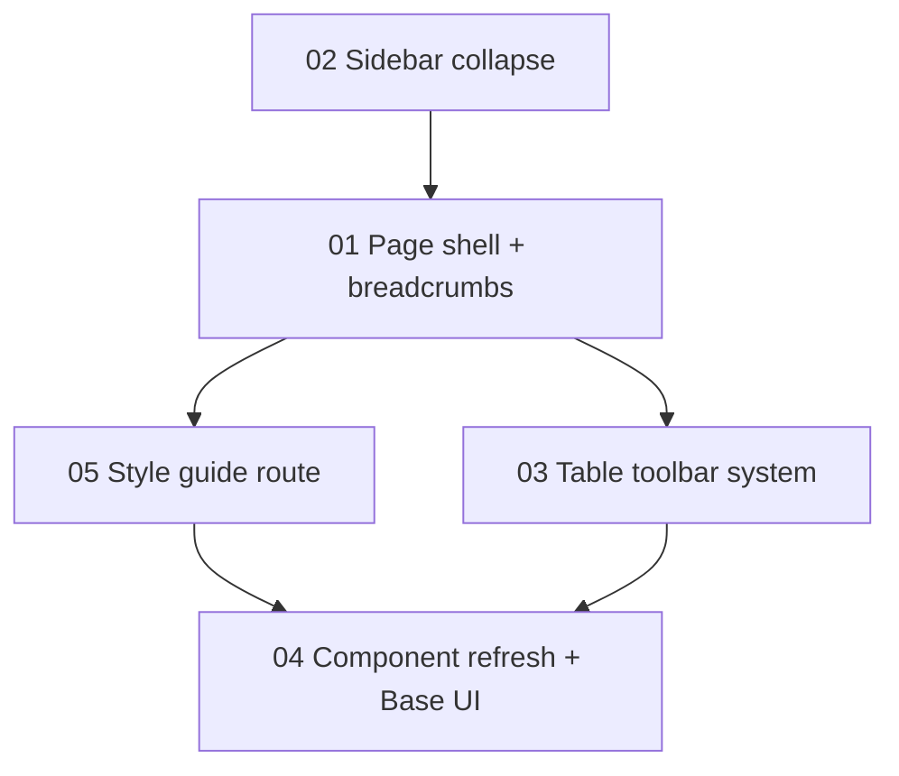

# PRD 004 — UI Density, Page Shell Unification, and Component Refresh

**Status:** Audited (2026-08-08) — architecture + product review complete ([ARCHITECTURE-REVIEW.md](ARCHITECTURE-REVIEW.md)), all findings resolved and folded in; ready to implement (order: 02 → 01 → 05 → 03 → 04)
**Depends on:** Nothing
**Blocks:** Nothing (but touching most dashboard surfaces — best merged during a quiet stretch, section by section)
**App:** `apps/internal/` only (client portal explicitly out of scope; see D12)

## The ask (verbatim intent)

1. Increase information density across the board — the sidebar is in a good spot; everything else should follow. The page header is too big, the description line is filler; replace it with a breadcrumb. Add a sidebar collapse-to-icons toggle.
2. Reuse more code across views — every view should pull from the same page shell: header with breadcrumbs, tabs row below with record count and primary action. Keep My Tasks' person switcher and the project detail burndown/time-log widget in the header right side. Spread the filter-dropdown pattern (currently on ~3 views) to all table views: filters left, sort dropdown right (sort labeled, filters not). *(Sort control later revised to clickable column headers — D6.)*
3. Increase density on the components themselves — lean on base shadcn styling, consider upgrading to Base UI now that shadcn supports it and Radix is winding down. Build a hidden style-guide page to see and tweak components wholesale.
4. (Added during review) Search inputs above the tables for quick filtering, and a ⌘K global command palette for quick navigation — which also becomes the record quick-switcher, replacing the combobox page headers.

## What the investigation found

Full details in the four findings sections below the plan; headlines first:

- **There is no page shell.** The header is a context/portal slot (`AppShellHeader` in `components/layout/app-shell.tsx`) that takes arbitrary JSX. The `h1 + description` block is copy-pasted into **~22 files**; a title-typography change today means 22 edits.
- **Two title scales coexist.** Plain pages render `text-2xl`; the clients/projects combobox headers render `text-3xl` with no description — the header bar visibly changes height as you navigate between siblings.
- **Zero breadcrumbs, zero user-facing sort, zero search inputs** anywhere in the dashboard — though the server already parses `?q=` for clients, contacts, and projects (dead capability, no UI).
- **The tabs/count/action row is copy-pasted ~12×**, and there are **nine near-identical `*TabsNav` components** differing only in their tab arrays.
- **Three filter implementations, two incompatible idioms** (users + submissions: URL-param single-`Select`s, server-filtered; projects: bespoke multi-select popover, client-filtered). The `updateParams` closure is byte-for-byte duplicated between users and submissions.
- **The sidebar is fully custom** (~140 lines, `w-56`), not shadcn's sidebar primitives. No collapse state, and **no mobile navigation at all** below 768px — the sidebar just disappears with nothing replacing it. Every dependency the shadcn sidebar needs (tooltip, sheet, `--sidebar-*` tokens, `useIsMobile`) is already in the repo.
- **The component library is stock shadcn "new-york" density** with four deliberate deviations (button, tabs, form, sheet). `tabs.tsx` is stale pre-v4 code (`h-10` list vs current `h-9`, 20 importers). Radix is installed as 16 individual `@radix-ui/react-*` packages — the layout shadcn deprecated in Feb 2026 in favor of the unified `radix-ui` package.
- **Base UI is now shadcn's default** (July 2026), with full component parity, a `--base` CLI flag, and an official gradual-migration path. Nothing Base-UI-related is installed yet.
- **No style guide, Storybook, or showcase route exists.** `docs/design-system.md` covers only the object-identity color system.

## Proposed plan — five sections

### 01 — Page shell + breadcrumb header (High complexity, the foundation)

Create a real `PageShell` in `components/layout/` that owns everything between the sidebar and the content:

- **Header row (one line, compact).** Replace the icon-tile + `text-2xl` title + description stack with: `SidebarTrigger` · breadcrumb · right-side slot. Target roughly half the current header height (`py-4` → `py-2`, breadcrumb at `text-sm`/`text-base` final segment). The description line is deleted everywhere (D1).
- **Breadcrumb** (new `components/ui/breadcrumb.tsx` via shadcn). Segments derive from the nav config (group → section), so "Work / Projects" comes free from `NAV_GROUPS`. Crumbs are **plain text/links** — e.g. `Work / Projects / GFNC · Marketing Site`; section-level crumbs navigate, group labels are static (no landing pages exist) (D2). The `heading` combobox variant of `SearchableCombobox` is retired; quick-switching moves to the ⌘K palette (D13). The ⌘[/⌘] prev/next-record shortcuts survive as a page-level hook detached from the combobox (D14).
- **⌘K command palette** (D13) — rehabilitates the existing `CommandDialog` (fixing its DialogTitle-outside-DialogContent a11y bug as a prerequisite). Ships in this section with: page/tab navigation derived from `NAV_GROUPS`, plus **record jump for clients and projects** — those two must ship here because this section retires their combobox headers, and their server-side `buildSearchCondition` search already exists. Debounced lookup via a small API route. Contacts and further record types extend the palette in section 03.
- **Toolbar row** under the header: left = `TabsNav` (one config-driven component replacing all nine copies), right = record count (`Showing N of M` once filters exist) + primary action button. Pages declare `{ tabs, count, primaryAction }` as props instead of copy-pasting the 12-line flex idiom.
- **Right-side header slot** stays: My Tasks mounts `PersonSelector`, project detail mounts `ProjectBurndownWidget` (with its View/Add time-log buttons), exactly as today (D3).
- Fix the incidental inconsistencies while in there: header icon no longer nav-derived (breadcrumb replaces it), `/invoices/settings` mislabeled title, the duplicated route-match logic between `sidebar.tsx` and `app-shell.tsx`.

**Migration mechanics:** `PageShell` lands alongside the existing slot; pages convert route-group by route-group (each conversion is a small, reviewable PR-sized chunk); `AppShellHeader` is deleted when the last page converts.

### 02 — Sidebar: adopt shadcn sidebar with icon collapse (Medium)

Adopt the shadcn `sidebar.tsx` primitive (`collapsible="icon"`) rather than extending the custom one (D4):

- Gets collapse-to-icons, `SidebarTrigger`, ⌘B shortcut, cookie-persisted state (SSR-correct, no flicker), tooltips-when-collapsed, and — the kicker — a `Sheet`-based **mobile drawer that closes the current "no nav below 768px" hole** in one move.
- The `--sidebar-*` tokens already sit unused in `globals.css`; the current compact visual language (`text-[12px]`, `size-3.5` icons, group labels, badge channel, theme-aware logo, dev pill) is re-homed into `SidebarMenu`/`SidebarGroup` markup.
- Reuse the existing `hooks/use-mobile.ts` (API-compatible); expect one round of scroll-container reconciliation with the `h-screen overflow-hidden` shell.

### 03 — Table toolbar: filters, sort, search (Medium-High, highest daily-use payoff)

One shared toolbar system, rolled out to every management table:

- **`useListParams()` hook** — collapses the duplicated `updateParams` closures; knows the reset key (`cursor`+`dir` vs `page`) per view; exposes `hasActiveFilters`.
- **`FilterBar` + `FilterSelect`** — config-driven (`{ key, placeholder, options, mode }`), no external labels (D5), one standard trigger width. `mode: 'single' | 'multi'` unifies the users/submissions Select idiom with the projects faceted popover; multi serializes comma-joined. All filtering moves **server-side** (projects' client-side filtering is the exception to normalize).
- **Sortable column headers** — allowlisted columns render a `SortableTableHead` (button + direction arrow, `aria-sort`); non-sortable columns stay plain (D6, revised). Server-driven via `?sort=field:dir` feeding the existing `orderBy`/cursor machinery — the `userSortExpression` seam in `lib/queries/users/settings.ts` is the template. Start with 2–3 obvious sorts per view (name, created, updated). The toolbar row is purely search + filters.
- **`SearchInput`** (debounced, in the FilterBar) — wires up the already-implemented `?q=` server support on clients/contacts/projects first; extend `buildSearchCondition` to users/invoices/hour-blocks after (D7).
- **⌘K palette record search extends** to contacts (existing server search) and any further entities whose `buildSearchCondition` lands in this section — the palette and the table search inputs share the same server predicates (D13).
- **Count moves into the toolbar row** as `Showing N of M` when filtered, fixing the "count outside the card, filters inside" split and submissions' double-count.
- Filtered empty states come free from `hasActiveFilters` (today only users does this correctly).

**Rollout order:** users + submissions (converting existing), then projects (idiom unification), then clients / contacts / hour-blocks / invoices / leads-archive.

### 04 — Component refresh + density pass + Base UI (Medium, mostly mechanical)

- **Scaffold `packages/ui` (`@pts/ui`)** (D15): shadcn's documented monorepo layout; internal is the only consumer this PRD. Components move into the package **as they're refreshed/migrated** — package membership is the live checklist of what's done. Client-portal adoption stays future scope.
- **Consolidate Radix**: run the shadcn `migrate radix` codemod → single `radix-ui` package (16 deps → 1). Low-risk, official codemod.
- **Opportunistic ports** (D16): `confirm-dialog` rebased on `alert-dialog` (wrapper API unchanged, 31 importers untouched); `hover-card` timeboxed port to the official primitive with touch-parity as the acceptance gate (keep custom on failure). `pagination-controls`, `searchable-combobox` (→ Base UI Combobox later), and toast→sonner explicitly stay as-is.
- **Base UI — start now, migrate gradually** (D8): flip `components.json` to `--base`, migrate the **stock, unmodified** components first (dialog, popover, select, dropdown-menu, checkbox, tooltip, etc. — the ones with zero custom code). Keep the heavily customized ones (`sheet.tsx` with `skipMountAnimation`/toast-aware dismiss, `searchable-combobox`, hover-card) on Radix until each is deliberately ported. Radix and Base UI coexist fine; shadcn ships both indefinitely.
- **Density corrections** while touching each component: refresh stale `tabs.tsx` to current shadcn (`h-9` list — 20 importers get denser for free), refresh `skeleton.tsx`, keep the custom button `xs`/`icon-sm` sizes but restore fixed heights (`h-9`/`h-8`) so buttons stop being ~2px taller than spec — this alone tightens every table row with an actions cell (~52px → ~48px).
- **Table density variants**: promote the monthly-close `tableClasses` experiment into `table.tsx` as `density: 'default' | 'compact'` (compact = `h-8` heads, `text-xs uppercase` headers, `py-1.5` cells), and standardize the four competing header treatments + two container radii.
- **Dead-code sweep** (found during investigation): delete unused `scroll-area.tsx`/`alert.tsx`, delete the orphaned `use-board-assigned-filter.ts` (167 lines, plumbed but never rendered), and verify the `command.tsx` `DialogTitle` a11y fix (landed in section 01 as a palette prerequisite).

### 05 — Hidden style-guide route (Low, do it early — it's the workbench)

Yes to the style guide (D9): a `/design` route in `(dashboard)` (admin-gated like everything else, just not in the nav) rendering every `components/ui/*` component in all variants/sizes/states, plus the table density variants, the toolbar system, and the object-identity color system from `docs/design-system.md`. Static page, no new deps, ~a day. **Build it right after 01** so every subsequent density tweak in 03/04 is visually verifiable in one place — it's the review surface for this whole PRD.

## What's NOT in scope

- `apps/client/` **adoption** of the shared UI package — its 5 drifted copies and divergent theming (media-query dark mode, different radius ladder) stay as-is; the `@pts/ui` package itself IS created in this PRD (D15) with internal as sole consumer, client adoption deferred to future scope
- The Tiptap `tiptap-ui-primitive/` parallel design system — bridged only inside the editor; untouched
- TanStack Table — the hand-rolled tables + a small `SortableTableHead` cover the need without a column-model dependency
- Board/kanban/calendar surface redesigns (leads board, my-tasks board) — they adopt the shell + header, nothing else
- New filter capabilities beyond spreading the existing pattern (no saved views, no filter chips)
- The homegrown toast system → sonner swap — works fine, separate concern

## Sections

| # | File | Complexity | Depends on |
|---|------|-----------|------------|
| 01 | [01-page-shell-breadcrumbs-palette.md](01-page-shell-breadcrumbs-palette.md) — `PageShell`, breadcrumb header, `TabsNav` consolidation, ⌘K palette (nav + clients/projects jump), ⌘[/⌘] extraction | High | 02 |
| 02 | [02-sidebar-collapse-mobile.md](02-sidebar-collapse-mobile.md) — shadcn sidebar adoption, icon collapse, mobile drawer | Medium | — |
| 03 | [03-table-toolbar-filters-sort-search.md](03-table-toolbar-filters-sort-search.md) — `useListParams`, FilterBar/FilterSelect/SearchInput toolbar, sortable column headers (server-driven), palette extension | Medium-High | 01 |
| 04 | [04-component-refresh-density-base-ui.md](04-component-refresh-density-base-ui.md) — `@pts/ui` scaffold, density corrections, table variants, Radix consolidation, gradual Base UI, confirm-dialog/hover-card ports | Medium | 05, 03 |
| 05 | [05-style-guide-route.md](05-style-guide-route.md) — admin-gated `/design` showcase | Low | 01 |
| 06 | [06-future-scope.md](06-future-scope.md) | — | — |

Progress tracking: [PROGRESS.md](PROGRESS.md) · Test plan: [TEST-PLAN.md](TEST-PLAN.md)

## Key decisions (locked 2026-08-08)

| # | Decision | Rationale |
|---|----------|-----------|
| D1 | **Delete the description line everywhere; breadcrumb replaces title.** No per-page opt-back-in. | "It's just taking up space." Every one of the 22 descriptions restates the title. |
| D2 | **Plain-text breadcrumbs everywhere, including record-scoped pages** — section-level parent crumbs are links, group segments are static labels (no landing pages exist); the combobox-header pattern is retired entirely and record quick-switching moves to the ⌘K palette (D13). *(Revised during review — Jason chose plain crumb over combobox-as-crumb.)* | Cleanest single-line header, one typography scale everywhere; the switcher survives in a better home. |
| D3 | **Header right slot survives** for My Tasks (person switcher) and project detail (burndown widget). Everything else gets no header extras. | Explicitly requested; they're the only two legitimate uses today. |
| D4 | **Adopt the shadcn sidebar primitive** rather than extending the custom sidebar. | Same effort class (~half a day vs 2–4h) but also delivers the mobile drawer, cookie persistence, ⌘B, and collapsed-state tooltips — four things we'd otherwise hand-build. |
| D5 | **Filters: no external labels; placeholder text carries the meaning.** *(Sort-label question mooted by D6 revision — header arrows self-label.)* | As requested. |
| D6 | **Sort is a server concern** (`?sort=` param → `orderBy` + cursor variants) with a small per-view allowlist — surfaced as **clickable column headers** (allowlisted columns only get the affordance), not a dropdown. *(Revised during review — Jason's call; frees the toolbar row for search + filters exclusively.)* | The per-field server cost (order expression + cursor variant) is identical for either control; headers win on familiarity, density, and in-context state visibility. The allowlist is expressed by which columns render `SortableTableHead`. |
| D7 | **Search ships where the server already supports it** (clients, contacts, projects) in the first pass; other views follow as query work allows. | Three views are literally free; don't gate them on the rest. |
| D8 | **Base UI migration starts now, component-by-component, stock components first; custom components stay Radix until deliberately ported.** | shadcn made Base UI the default (July 2026) and recommends exactly this gradual path; big-bang migration of `sheet.tsx`'s custom behaviors is where the risk lives, so it goes last. |
| D9 | **Style guide = `/design`, admin-gated, hidden from nav, built immediately after the shell.** | Cheap, and it becomes the acceptance surface for every density change in this PRD. |
| D10 | **Density targets:** header bar ~50% shorter; tabs `h-9`; buttons regain fixed heights (keep `xs`/`icon-sm`/`icon-lg`); tables get a `compact` variant applied to management tables. | Concrete, verifiable, reversible per-component on the style guide page. |
| D11 | **One `TabsNav` + one `PageShell` replace the 9 tab components and 22 header blocks.** | Straight DRY consolidation; config arrays stay colocated per feature. |
| D12 | **Internal portal only.** | Client portal has structural theming divergence; folding it in would double the scope for a surface that gets a fraction of the use. |
| D13 | **⌘K global command palette** (added during review): section 01 ships page/tab navigation from `NAV_GROUPS` **plus record jump for clients and projects**; section 03 extends record search to contacts and further entities as their `buildSearchCondition` lands. Palette and table search share the same server predicates. | Jason's ask. Clients/projects record jump cannot wait for 03 because 01 retires their combobox headers — and their server search already exists, so it's cheap. Rehabilitates the existing `CommandDialog` (a11y fix becomes a prerequisite, pulled forward from 04). |
| D14 | **⌘[/⌘] prev/next-record shortcuts are preserved** as a page-level hook on clients/projects detail pages, decoupled from the retired combobox components. | Muscle-memory feature that currently lives inside the combobox header components; it must not silently die with them. |
| D15 | **`packages/ui` (`@pts/ui`) is scaffolded in this PRD** (added during review — Jason's call), with internal as the only consumer; components move in as they're refreshed in 04, making package membership the migration checklist. Client-portal adoption remains future scope. | The "defer" reasoning only ever applied to client *adoption* (token unification); the package existing has no blocker, 04 already touches every component (import churn happens once), and it's shadcn's documented monorepo layout. |
| D16 | **Two bespoke components port to shadcn primitives now**: `confirm-dialog` → `alert-dialog` internals (API unchanged; gains no-outside-click-dismiss, correct for destructive confirms); `hover-card` → official primitive as a **timeboxed trial** gated on touch-behavior parity (custom kept if it fails). `pagination-controls` (it IS the logic; shadcn's is just markup), `searchable-combobox` (future Base UI Combobox port), and toast→sonner stay as-is. | "Port if it's basic and aligns with the shadcn API" — these two pass that test; the others don't yet. |

## Implementation order

1. **02 Sidebar** first (small, self-contained, delivers the `SidebarTrigger` the new header wants)
2. **01 Page shell** — the foundation everything else composes into
3. **05 Style guide** — immediately after, as the workbench
4. **03 Table toolbar** — highest daily-use value, independent of 04
5. **04 Component refresh + Base UI** — last, verified against the style guide

Rough sizing: 02 ≈ half a day · 01 ≈ 3–4 days (22 page conversions dominate; +~1 day for the ⌘K palette with clients/projects record jump) · 05 ≈ 1 day · 03 ≈ 2–3 days (query work for sort dominates) · 04 ≈ 3–4 days spread out (mechanical, per-component; includes the `@pts/ui` scaffold and the two opportunistic ports).

After each section: `npm run build`, `npm run lint`, `npm run type-check` from the repo root; update PROGRESS.md.

---

## Appendix — investigation findings (reference)

### A. Header / shell audit

- Chrome lives in `apps/internal/components/layout/app-shell.tsx`: header `px-4 py-4` + icon tile (`p-2` border chrome, icon derived by re-matching the pathname against `NAV_GROUPS` — logic duplicated verbatim from `sidebar.tsx`), then a `min-w-0 flex-1` slot filled per-page via `AppShellHeader` (context portal, `children`-only API, ~35 importers).
- The `h1(text-2xl) + p(text-sm muted)` block is hand-rolled in ~22 files; `home-dashboard.tsx` is the lone structural outlier (missing the flex wrapper). Combobox headers (`/clients`, `/projects`, project detail ×6) use `SearchableCombobox variant='heading'` at `text-3xl` with **no** description.
- Tabs/count/action row idiom copied ~12×; count dropped arbitrarily on activity tabs, submissions has counts but no add button, `/leads/archive` has neither.
- No breadcrumb component or usage anywhere; no `max-width` container anywhere in the dashboard chrome.
- `projects-board.tsx` renders `AppShellHeader` from two branches (empty state vs loaded) with different composition.

### B. Table / filter audit

- Every table is hand-rolled JSX over `components/ui/table.tsx` (stock dense v4: `h-10` heads, `p-2` cells, `text-sm`). No TanStack Table, no DataTable abstraction.
- Filters exist on exactly 3 views. Users (`users-filters.tsx`) + submissions (`submissions-filters.tsx`): URL-param `Select`s, server-filtered, `updateParams` duplicated byte-for-byte (only the reset key differs: `cursor`/`dir` vs `page`). Projects (`project-status-filter.tsx` + `projects-landing.tsx:127-172`): multi-select popover, client-side filtering, bespoke URL logic, and the filter control only renders above the client-projects table though it filters all three sections.
- Sort: zero user-facing controls; ordering hardcoded per query, coupled to keyset cursors (`buildUserCursorCondition` etc.). `userSortExpression` in `lib/queries/users/settings.ts:107` is the existing seam to generalize.
- Search: zero inputs, but `?q=` parsed + `buildSearchCondition` implemented for clients, contacts, projects (dead capability).
- Dead code: `use-board-assigned-filter.ts` (167 lines, plumbed through board state, never rendered).
- Density inconsistencies: four header-row treatments (`bg-muted/40` default / `bg-muted/30 text-xs uppercase` review tab / `bg-muted/50 h-8 text-[10px]` monthly close / unstyled invoice settings); two container radii (`rounded-xl` vs `rounded-lg`); real management-table row height ~52px, driven by `size='icon'` (h-9) action buttons.
- `pagination-controls.tsx` is genuinely shared (cursor + paged modes) and stays.

### C. Sidebar audit

- `components/layout/sidebar.tsx` (140 lines), custom, `w-56` hard-coded, `hidden md:flex` — **no mobile nav exists at all**. Nav data in `navigation-config.ts` (5 groups, 12 items, all with lucide icons). Badge channel generic (submissions count today).
- Everything shadcn's sidebar needs is already present: `tooltip.tsx` (self-providing), `sheet.tsx` (`side='left'`), `hooks/use-mobile.ts` (API-compatible), `--sidebar-*` tokens (defined, unused), `components.json` (new-york). Two watch-items: hook filename collision (reuse ours) and scroll-model reconciliation with the `h-screen overflow-hidden` shell.

### D. Component inventory

- 38 files in `components/ui/`. Stock/unmodified: ~17. Customized: `button` (padding-based heights, +`xs`/`icon-sm`/`icon-lg`, 73 importers), `tabs` (**stale pre-v4**, `h-10`, 20 importers), `form` (`text-xs` messages), `sheet` (most-divergent: size prop, `skipMountAnimation`, toast-aware dismiss, tinted header), `badge` (`rounded-full`), `switch` (+`sm`), `select`/`tooltip` (minor). Bespoke: `searchable-combobox` (18 importers), `confirm-dialog` (31), `disabled-field-tooltip` (42), `pagination-controls`, `hover-card` (popover-based), homegrown toast system, `phone-input`.
- Bug: `command.tsx` renders the sr-only `DialogHeader`/`DialogTitle` **outside** `DialogContent` — Radix a11y violation, dialog unlabeled. Dead: `scroll-area.tsx`, `alert.tsx` (0 importers each).
- Deps: 16 individual `@radix-ui/react-*` packages (pre-consolidation layout); Tailwind v4.3.3 CSS-first (no config file); **no Base UI**; no font-size or spacing overrides anywhere — density is purely component-level.
- Missing from registry: sidebar, breadcrumb, sonner, data-table, calendar/date-picker, radio-group, and ~10 others.
- `apps/client/` holds 5 drifted copies (`button`, `badge`, `dropdown-menu`, `avatar`, `skeleton`) with `dark:` classes stripped — structural theming divergence, no `components.json`, no shared `packages/ui`.
- No Storybook/showcase anywhere; `docs/design-system.md` covers only object-identity colors.

### E. Base UI landscape (external)

Base UI 1.0 shipped Dec 2025 (MUI team). shadcn reached full Base UI parity Jan 2026 (`--base` flag), consolidated Radix into the single `radix-ui` package Feb 2026 (`migrate radix` codemod), and made **Base UI the default for new projects July 2026** — Radix variants continue shipping, and the officially recommended migration is gradual, component-by-component. Sources: [shadcn changelog](https://ui.shadcn.com/docs/changelog), [Base UI as the Default](https://ui.shadcn.com/docs/changelog/2026-07-base-ui-default), [migration discussion](https://github.com/shadcn-ui/ui/discussions/9562).
