# Place to Stand: Agency Pipeline Flowchart

## Overview

This document maps the complete lifecycle of a client relationship from initial lead intake through active project management and autonomous bug fixing.

---

## Master Flowchart

```mermaid
flowchart TB
    subgraph INTAKE["📥 LEAD INTAKE"]
        direction LR
        EMAIL_LEAD[/"📧 Email"/]
        WEBSITE_LEAD[/"🌐 Website Form"/]
        REFERRAL_LEAD[/"🤝 Referral"/]
    end

    subgraph SALES["💼 SALES PIPELINE"]
        direction TB
        NEW_LEAD["🆕 New Lead"]
        MEETING_SCHEDULED["📅 Meeting Scheduled"]
        MEETING_COMPLETED["✅ Meeting Completed"]
        PROPOSAL_DRAFT["📝 Proposal Draft"]
        PROPOSAL_SENT["📤 Proposal Sent"]
        NEGOTIATION["🔄 Negotiation"]
        CONTRACT_READY["📋 Contract Ready"]
        CONTRACT_SIGNED["✍️ Contract Signed"]
        CLOSED_LOST["❌ Closed Lost"]
        ON_ICE["🧊 On Ice"]
    end

    subgraph ONBOARDING["🚀 CLIENT ONBOARDING"]
        direction TB
        CLIENT_CREATED["👤 Client Created"]
        INITIAL_PROJECT["📁 Initial Project"]
        SOW_CREATED["📄 Scope of Work"]
        AI_PRD["🤖 AI Generates PRD"]
        PRD_REVIEW["👁️ PRD Review"]
        REPO_SETUP["🔧 Repo Setup"]
        CREDS_SETUP["🔐 Credentials Vault"]
        HOUR_BLOCK["⏱️ Hour Block Created"]
    end

    subgraph DEVELOPMENT["⚙️ ACTIVE DEVELOPMENT"]
        direction TB

        subgraph EMAIL_LOOP["📬 Email Intelligence"]
            GMAIL_SYNC["Gmail Sync"]
            AI_ANALYSIS["AI Analysis"]
            TASK_SUGGESTIONS["Task Suggestions"]
        end

        subgraph TASK_MGMT["📋 Task Management"]
            BACKLOG["Backlog"]
            ON_DECK["On Deck"]
            IN_PROGRESS["In Progress"]
            IN_REVIEW["In Review"]
            DONE["Done"]
        end

        subgraph TIME_TRACKING["⏰ Time & Billing"]
            TIME_LOG["Time Logged"]
            HOURS_DEDUCTED["Hours Deducted"]
            LOW_HOURS_ALERT["Low Hours Alert"]
            BLOCK_RENEWAL["Block Renewal"]
        end
    end

    subgraph BUGBOT["🤖 AUTONOMOUS BUG FIXING"]
        direction TB
        BUG_INTAKE["🐛 Bug Report"]
        BUG_ANALYSIS["🔍 AI Analysis"]
        SANDBOX_EXEC["🐳 Sandbox Execution"]
        FIX_ATTEMPT["🔧 Fix Attempt"]
        PR_CREATED["📤 PR Created"]
        HUMAN_NEEDED["👨‍💻 Human Needed"]
        FIX_MERGED["✅ Fix Merged"]
    end

    subgraph LIFECYCLE["🔄 PROJECT LIFECYCLE"]
        direction TB
        ACTIVE_PROJECT["🟢 Active Project"]
        PROJECT_COMPLETE["✅ Project Complete"]
        MAINTENANCE["🔧 Maintenance Mode"]
        NEW_PROJECT["➕ New Project"]
    end

    %% Lead Intake Flows
    EMAIL_LEAD --> NEW_LEAD
    WEBSITE_LEAD --> NEW_LEAD
    REFERRAL_LEAD --> NEW_LEAD

    %% Sales Pipeline Flow
    NEW_LEAD --> MEETING_SCHEDULED
    NEW_LEAD --> ON_ICE
    NEW_LEAD --> CLOSED_LOST
    MEETING_SCHEDULED --> MEETING_COMPLETED
    MEETING_SCHEDULED --> ON_ICE
    MEETING_COMPLETED --> PROPOSAL_DRAFT
    MEETING_COMPLETED --> CLOSED_LOST
    PROPOSAL_DRAFT --> PROPOSAL_SENT
    PROPOSAL_SENT --> NEGOTIATION
    PROPOSAL_SENT --> CLOSED_LOST
    PROPOSAL_SENT --> ON_ICE
    NEGOTIATION --> CONTRACT_READY
    NEGOTIATION --> PROPOSAL_DRAFT
    CONTRACT_READY --> CONTRACT_SIGNED
    ON_ICE -.-> NEW_LEAD

    %% Sales to Onboarding
    CONTRACT_SIGNED --> CLIENT_CREATED
    CLIENT_CREATED --> INITIAL_PROJECT
    CLIENT_CREATED --> HOUR_BLOCK
    INITIAL_PROJECT --> SOW_CREATED
    SOW_CREATED --> AI_PRD
    AI_PRD --> PRD_REVIEW
    PRD_REVIEW --> REPO_SETUP
    PRD_REVIEW -.->|Revisions| AI_PRD
    REPO_SETUP --> CREDS_SETUP
    CREDS_SETUP --> ACTIVE_PROJECT

    %% Development Loop
    ACTIVE_PROJECT --> GMAIL_SYNC
    GMAIL_SYNC --> AI_ANALYSIS
    AI_ANALYSIS --> TASK_SUGGESTIONS
    TASK_SUGGESTIONS --> BACKLOG
    BACKLOG --> ON_DECK
    ON_DECK --> IN_PROGRESS
    IN_PROGRESS --> IN_REVIEW
    IN_REVIEW --> DONE
    IN_REVIEW -.->|Needs Work| IN_PROGRESS

    %% Time Tracking
    IN_PROGRESS --> TIME_LOG
    TIME_LOG --> HOURS_DEDUCTED
    HOURS_DEDUCTED --> LOW_HOURS_ALERT
    LOW_HOURS_ALERT --> BLOCK_RENEWAL
    BLOCK_RENEWAL --> HOUR_BLOCK

    %% Bug Bot Flow
    ACTIVE_PROJECT --> BUG_INTAKE
    BUG_INTAKE --> BUG_ANALYSIS
    BUG_ANALYSIS --> SANDBOX_EXEC
    SANDBOX_EXEC --> FIX_ATTEMPT
    FIX_ATTEMPT --> PR_CREATED
    FIX_ATTEMPT -.->|Failed| HUMAN_NEEDED
    PR_CREATED --> FIX_MERGED
    HUMAN_NEEDED --> BACKLOG
    FIX_MERGED --> ACTIVE_PROJECT

    %% Project Lifecycle
    DONE --> PROJECT_COMPLETE
    PROJECT_COMPLETE --> MAINTENANCE
    MAINTENANCE --> NEW_PROJECT
    NEW_PROJECT --> INITIAL_PROJECT
    MAINTENANCE --> BUG_INTAKE

    %% Styling
    classDef intake fill:#e1f5fe,stroke:#01579b
    classDef sales fill:#fff3e0,stroke:#e65100
    classDef onboard fill:#e8f5e9,stroke:#1b5e20
    classDef dev fill:#f3e5f5,stroke:#4a148c
    classDef bugbot fill:#ffebee,stroke:#b71c1c
    classDef lifecycle fill:#e0f2f1,stroke:#004d40

    class EMAIL_LEAD,WEBSITE_LEAD,REFERRAL_LEAD intake
    class NEW_LEAD,MEETING_SCHEDULED,MEETING_COMPLETED,PROPOSAL_DRAFT,PROPOSAL_SENT,NEGOTIATION,CONTRACT_READY,CONTRACT_SIGNED,CLOSED_LOST,ON_ICE sales
    class CLIENT_CREATED,INITIAL_PROJECT,SOW_CREATED,AI_PRD,PRD_REVIEW,REPO_SETUP,CREDS_SETUP,HOUR_BLOCK onboard
    class GMAIL_SYNC,AI_ANALYSIS,TASK_SUGGESTIONS,BACKLOG,ON_DECK,IN_PROGRESS,IN_REVIEW,DONE,TIME_LOG,HOURS_DEDUCTED,LOW_HOURS_ALERT,BLOCK_RENEWAL dev
    class BUG_INTAKE,BUG_ANALYSIS,SANDBOX_EXEC,FIX_ATTEMPT,PR_CREATED,HUMAN_NEEDED,FIX_MERGED bugbot
    class ACTIVE_PROJECT,PROJECT_COMPLETE,MAINTENANCE,NEW_PROJECT lifecycle
```

---

## Detailed Stage Breakdowns

### 1. Lead Intake Sources

```mermaid
flowchart LR
    subgraph SOURCES["Lead Sources"]
        direction TB
        E1["📧 Gmail Inbox"]
        E2["🌐 Website Contact Form"]
        E3["🤝 Manual Referral Entry"]
        E4["📱 Future: LinkedIn"]
    end

    subgraph PROCESSING["AI Processing"]
        direction TB
        P1["Extract Contact Info"]
        P2["Identify Company"]
        P3["Detect Intent"]
        P4["Score Lead Quality"]
    end

    subgraph OUTPUT["Lead Created"]
        L1["Lead Record"]
        L2["Contact Record"]
        L3["Activity Log"]
    end

    E1 --> P1
    E2 --> P1
    E3 --> P1
    E4 --> P1
    P1 --> P2 --> P3 --> P4
    P4 --> L1
    P4 --> L2
    P4 --> L3
```

### 2. Sales Pipeline Detail

```mermaid
flowchart TB
    subgraph QUALIFICATION["🎯 Qualification"]
        Q1["Lead Received"]
        Q2["Initial Research"]
        Q3["Qualify/Disqualify"]
    end

    subgraph OUTREACH["📧 Outreach (Gmail Send)"]
        O1["Compose Email"]
        O2["Use Template"]
        O3["Send via Gmail"]
        O4["Track in Portal"]
        O5["Await Response"]
    end

    subgraph DISCOVERY["🔍 Discovery"]
        D1["Schedule Meeting"]
        D2["Calendar Integration"]
        D3["Send Confirmation Email"]
        D4["Meeting Prep Notes"]
        D5["Discovery Call"]
        D6["Requirements Captured"]
    end

    subgraph PROPOSAL["📝 Proposal"]
        P1["Generate Proposal"]
        P2["AI Draft Content"]
        P3["Pricing Calculator"]
        P4["Review & Edit"]
        P5["Send via Gmail"]
        P6["Track Opens/Views"]
    end

    subgraph CLOSING["✍️ Closing"]
        C1["Negotiation"]
        C2["Contract Generation"]
        C3["E-Signature (Future)"]
        C4["Payment/Deposit"]
        C5["Convert to Client"]
    end

    Q1 --> Q2 --> Q3
    Q3 -->|Qualified| O1
    Q3 -->|Not Qualified| DISCARD["Archive"]

    O1 --> O2 --> O3 --> O4 --> O5
    O5 -->|Response| D1

    D1 --> D2 --> D3 --> D4 --> D5 --> D6
    D6 --> P1

    P1 --> P2 --> P3 --> P4 --> P5 --> P6
    P6 --> C1

    C1 --> C2 --> C3 --> C4 --> C5
```

### 3. Project Initiation (AI-Powered)

```mermaid
flowchart TB
    subgraph SOW["📄 Scope of Work"]
        S1["Import from Proposal"]
        S2["Define Deliverables"]
        S3["Set Milestones"]
        S4["Confirm Budget/Hours"]
    end

    subgraph PRD["🤖 AI PRD Generation"]
        P1["Analyze SOW"]
        P2["Generate Sections"]
        P3["Technical Requirements"]
        P4["User Stories"]
        P5["Acceptance Criteria"]
        P6["Human Review"]
        P7["Finalize PRD"]
    end

    subgraph REPO["🔧 Repository Setup"]
        R1["Select Template"]
        R2["Create GitHub Repo"]
        R3["Configure CI/CD"]
        R4["Set Branch Protections"]
        R5["Add Team Access"]
    end

    subgraph CREDS["🔐 Credentials"]
        C1["Request from Client"]
        C2["Encrypt & Store"]
        C3["Set Access Policies"]
        C4["Audit Logging"]
    end

    subgraph TASKS["📋 Initial Tasks"]
        T1["PRD → Task Extraction"]
        T2["AI Suggests Tasks"]
        T3["Human Review"]
        T4["Populate Backlog"]
    end

    S1 --> S2 --> S3 --> S4
    S4 --> P1
    P1 --> P2 --> P3 --> P4 --> P5 --> P6
    P6 -->|Approved| P7
    P6 -->|Revisions| P2
    P7 --> R1
    R1 --> R2 --> R3 --> R4 --> R5
    R5 --> C1
    C1 --> C2 --> C3 --> C4
    C4 --> T1
    T1 --> T2 --> T3 --> T4
```

### 4. Active Development Cycle

### 5. Hour Block Lifecycle

### 6. Autonomous Bug Fixing

### 7. Multi-Project Client

---

## Integration Points

### External Systems

---

## Data Flow Summary

---

## Next Steps

See `roadmap-phases.md` for the detailed implementation plan broken into small, mergeable PRs.
